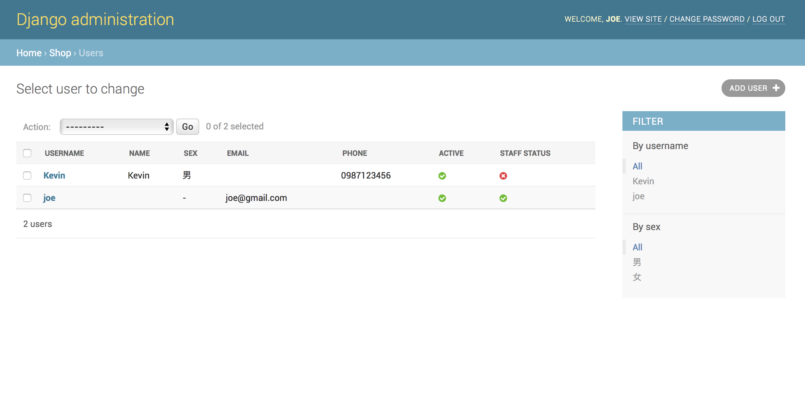
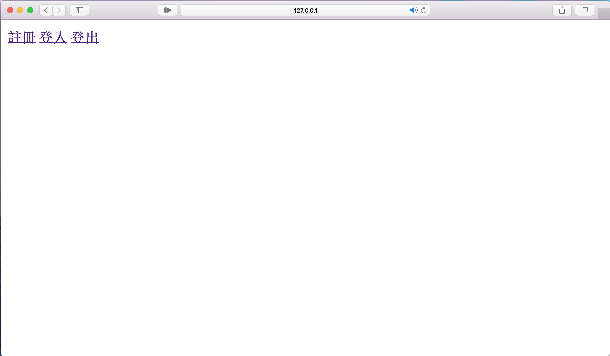
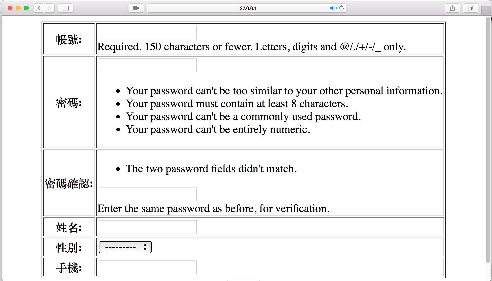
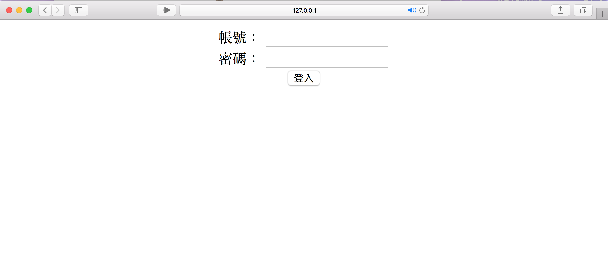
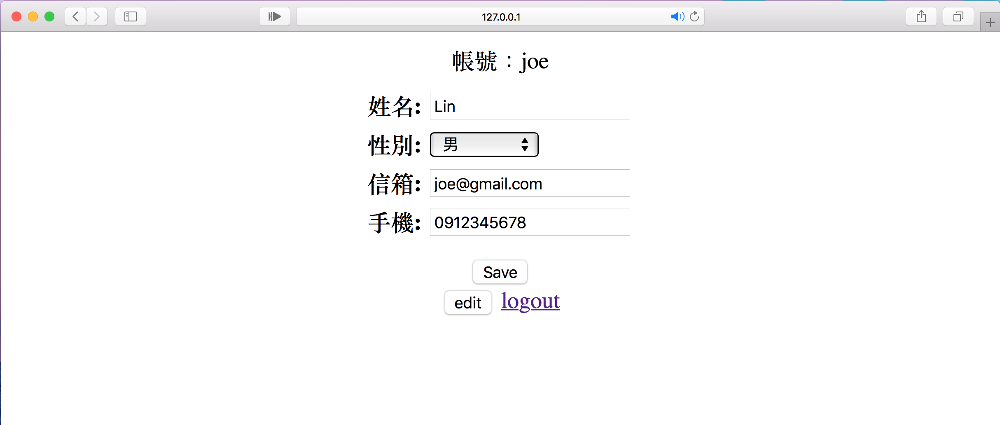
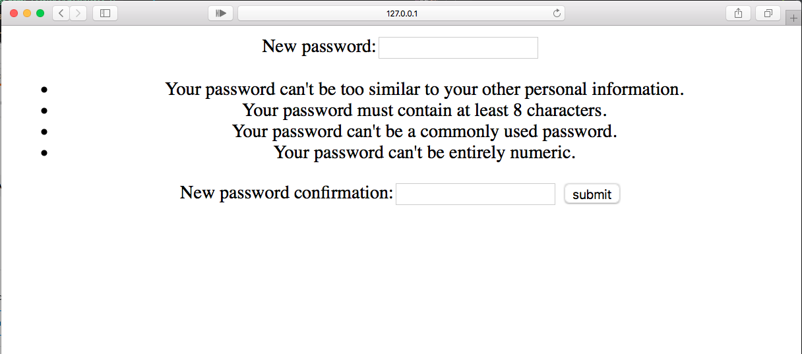

# 製作能讓使用者註冊及登入的頁面 #
---
> This repository contains code I have tested before. If you follow the markdown file and get errors, please download this repository and run it first.
---
## 目錄

- [需求](#requirement)
- [環境](#environment)

- [建立model](#model)
- [建立資料庫、superuser](#database_superuser)
- [使用python shell建立新的user](#shell)
- [建立首頁、URL pattern](#home)
- [建立註冊頁面](#register)
- [登入、登出](#log)
- [個人頁面修改](#revise)
<a name='requirement'></a>
---
## 需求
1. 使用者能註冊，包含*帳號、密碼、姓名、性別、電話號碼、郵件*
2. 使用者能登入跟登出
3. 使用者能修改資料，僅限*密碼、姓名、性別、電話號碼、郵件*
4. 能夠在`admin interface`查看所有使用者資料
> 環境
- [python3.6](https://www.python.org)
- [Django1.11.11](https://www.djangoproject.com)
<a name="environment"></a>
---
## 建立環境

確認python,Django版本
```
$ python -V #python3.6.3
$ python -m django --version #django1.11.11
```  

使用Django建立專案**my_web**  
```
$ django-admin.py startproject myweb
```  
建立完成後執行下列指令  
```console
$ python manage.py runserver
```  
看見成功的頁面即可繼續。  

建立一個app叫**shop**
```console
$ python manage.py startapp shop
```  

*在django的一個project裡可以有很多application，每個app都是獨立的，可視為套件，可以給不同的project使用或給其他人使用*

建立好app後，先記得在project裡的settings.py中的**INSTALLED_APPS**登錄  
```python
# myweb/settings.py  
INSTALLED_APPS = [
'django.contrib.admin',
'django.contrib.auth',
'django.contrib.contenttypes',
'django.contrib.sessions',
'django.contrib.messages',
'django.contrib.staticfiles',
'shop',
]
```
---
<a name="model"></a>

##  建立model
>  如果app需要使用到資料庫，models的功用就是建立table和定義各欄位。

考慮到我們的應用，我們需要讓使用者登入，還要儲存姓名等額外資料。

光是讓使用者登入就必須花不少力氣，首先*username*也就是我們習慣稱的*帳號*必須滿足  `唯一性(Uniqueness)` ，還有password在資料庫儲存的型態必須為hash過的，也就是密碼不能以明文儲存在資料庫中。[(Password management in Django)](https://docs.djangoproject.com/en/2.1/topics/auth/passwords/#password-management-in-django)  
為了使開發者快速建立應用，Django提供AbstractUser來讓開發者新增所欄位，AbstractUser大致上滿足我們對於管理使用者帳號密碼的想像需求(或許它還想到你還沒想到的)而不用擔心密碼儲存方式、Permission等問題[(source code of AbstractUser)](https://github.com/django/django/blob/master/django/contrib/auth/models.py)。
接下來我們使用AbstractUser來新增我們想要的欄位。

```python
# shop/models.py
from django.db import models
from django.contrib.auth.models import AbstractUser
from django.core.validators import RegexValidator
class User(AbstractUser):
    gender = (
        ("male", '男'),
        ("female", '女')
    )
    phone_reg = RegexValidator(r'^09\d{2}-?\d{3}-?\d{3}$',"Please enter valid Taiwanese phone number.")
    name = models.CharField(max_length=20)
    email = models.EmailField(blank=True)
    sex = models.CharField(max_length=10,choices=gender)
    phone = models.CharField(max_length=20, validators=[phone_reg])

    def __str__(self):
        return self.name
```
> Django 提供了許多[Field types](https://docs.djangoproject.com/en/2.1/ref/models/fields/#field-types)，像是最常用的CharField，和信箱的EmailField，可以防止使用者在更新或註冊的時有錯誤。
> 
>
>首先考慮我們所需要的欄位
> 
> 1. 帳號(username):此部分由AbstractUser提供
> 2. 密碼(password):AbstractUser提供
> 3. 姓名(name):CharField
> 4. 信箱(email):EmailField(blaank設為True代表此欄位非必要)
> 5. 性別(sex):CharField(特別使用choices限制註冊只能選擇男or女)
> 6. 手機(phone):CharField(使用regex限制註冊要使用正常的手機號碼)

到`myweb/settings.py`加入  
```python
AUTH_USER_MODEL = 'shop.User'
```  
代表我們不使用Django預設的User模型，改用我們定義的模型。

建立完model之後，如果希望在admin後台查看資料，需要到該app資料架下的`admin.py`註冊

```python
# shop/admin.py
from django.contrib import admin

# Register your models here.
from .models import User   # 這邊一定要匯入User，感謝RelaxOP提醒
from django.contrib.auth.admin import UserAdmin

@admin.register(User)
class newUserAdmin(admin.ModelAdmin):
    list_display = ('username', 'name', 'sex','email','phone','is_active','is_staff')
    list_filter = ('username','sex',)

```
---
<a name="database_superuser"></a>

## 建立資料庫、superuser

完成`models.py`後，就要migrate到資料庫。

首先是`makemigrations`此段指令是透過`models.py`在原app底下建立`migrations`資料下記錄對model的更動，並提供之後`migrate`所需的SQL commands。而`migrate`執行產生的SQL commands。

```console
$ python manage.py makemigrations
$ python manage.py migrate
```

### 建立superuser
```console
$ python manage.py createsuperuser
```
接著會需要輸入帳號及密碼，完成之後打開瀏覽器輸入網址[127.0.0.1:8000/admin](127.0.0.1:8000/admin)會看到以下頁面


登入之後會看到以下頁面


<a name="shell"></a>
> 使用Python Shell建立user
> > Django 提供可以互動的Shell，如果不熟悉SQL command，可以透過Shell來對操作資料庫。
[更多操作可以參考此連結](https://docs.djangoproject.com/en/2.1/topics/db/queries/)

```
$ python manage.py shell
Python 3.6.3 (v3.6.3:2c5fed86e0, Oct  3 2017, 00:32:08)
[GCC 4.2.1 (Apple Inc. build 5666) (dot 3)] on darwin
Type "help", "copyright", "credits" or "license" for more information.
(InteractiveConsole)
>>> from shop.models import User
>>> user = User(username="Kevin", password="password_test")
>>> user.phone = "0987123456"
>>> user.sex = "male"
>>> user.name = "Kevin"
>>> user.save()
>>> quit()
```
在admin頁面SHOP下的Users就會新增Kevin，點進去如下圖
  

---
<a name="home"></a>

## 建立首頁、URL pattern  

首先在`shop`下建立`templates`資料夾，templates會儲存`shop`需要的html模板。先新增`home.html、 ligin.html、 personal.html、 register.html`空白檔案。

先完成`home.html`
```html
<!--shop/templates/home.html-->
<a href="register">註冊</a>
<a href="login">登入</a>
<a href="logout">登出</a>
```

在`shop/views.py`加入以下程式
```python
from django.shortcuts import render

def home(request):
    return render(request,'home.html')
def register(request):
    return render(request,'register.html')
def User_login(request):
    return render(request,'login.html')
def personal(request):
    return render(request,'personal.html')
def User_logout(request):
    return render(request,'home.html')
```
> 在Django中，`views.py`負責接收網頁的請求(request)並回傳對應的網頁內容[(Document of views in Django)](https://docs.djangoproject.com/en/2.1/topics/http/views/#writing-views)

接下來是網頁最重要的內容，就是URL pattern，怎樣的URL對應到的網頁內容雖然可以隨便定義，但是良好的設計除了方便除錯，精簡而有意義的設計也可以增加使用者的好感。[(URL design)](https://indieweb.org/URL_design)

在`shop`資料夾下新增`urls.py`
```python
# shop/urls.py
from django.conf.urls import url
from . import views

urlpatterns = [
    url(r'^$',views.home),
    url(r'^register/',views.register),
    url(r'^login/',views.User_login),
    url(r'^personal/',views.personal),
    url(r'^logout/',views.User_logout),
]
```
在`myweb`底下的`urls.py`新增`shop`的url
```python
# myweb/urls.py
from django.conf.urls import url, include
from django.contrib import admin

urlpatterns = [
    url(r'^admin/', admin.site.urls),
    url(r'^',include('shop.urls')),
]
```
再次打開[127.0.0.1:8000](127.0.0.1:8000)，會發現頁面已經變成home.html的樣子


---
<a name="register"></a>

## 建立註冊頁面
>> 一個註冊的頁面對html來說就是一個`form`，利用`POST`方法對資料庫做新增動作。而Django也提供了快速製作form的方法[(Working with forms)](https://docs.djangoproject.com/en/2.1/topics/forms/)

在`shop`下新增`form.py`
```python
# shop/form.py
from django.forms import ModelForm
from .models import User
from django.contrib.auth.forms import UserCreationForm

class RegisterForm(UserCreationForm):
    def __init__(self, *args, **kwargs):
        super(RegisterForm, self).__init__(*args, **kwargs)
        # 要override password1,2 的label必須要從這裡改
        self.fields['password1'].label = "密碼"
        self.fields['password2'].label = "密碼確認"
    class Meta:
        model = User
        # 決定註冊欄位要有哪些及順序
        fields = ('username','password1','password2','name','sex','phone')
        # 各欄位顯示的標籤，如沒有則就是原本的變數名稱
        labels = {
            "username": "帳號",
            "name":"姓名",
            "sex":"性別",
            "phone":"手機",
        }
```
`Register`繼承了`UserCreationForm`，因為Django原本的`UserCreationForm`只有`username`跟`password1(密碼)`及`password2(密碼確認)`，為了新增其他的欄位，我們新增`RegisterForm`，如何顯示label，或是決定要出現哪些欄位，都可以從這裡調整。[(Creating forms from models)](https://docs.djangoproject.com/en/1.10/topics/forms/modelforms/)

接著在`views.py`中把我們完成的`UserCreationForm`引入到我們的template中。
```python
# 在前面先引入必要的function
from django.http import HttpResponseRedirect
from django.contrib.auth import authenticate, login, logout
from .models import User
from .form import RegisterForm

def register(request):
if request.method == 'POST':
    form = RegisterForm(request.POST)
    if form.is_valid():
        new_user = form.save()
        # 如果希望註冊完馬上登入可加入，若無需求可不加
        # ------------------------------------
        username = form.cleaned_data.get('username')
        raw_password = form.cleaned_data.get('password1')
        user = authenticate(username=username, password=raw_password)
        login(request, user)
        # ------------------------------------
        return HttpResponseRedirect('/')
else:
    form = RegisterForm()
return render(request,'register.html',{'form':form,})
```

> Django有自己的一套模版系統，我們可以透過Django template language(DTL)或是選擇Jinja2，來動態產生網頁。
> > - [templates in Django](https://docs.djangoproject.com/en/2.1/topics/templates/#module-django.template)
> > - [Jinja2](http://jinja.pocoo.org)

更改`shop/templates/register.html`如下 
```jinja
<!DOCTYPE html>
<head>
    <meta charset="utf-8">
</head>
<body>
    <center>
        <form method="POST" class="post-form">
        
            <table border="1">
               {{ form }}
            </table>
            <button type="submit">submit</button>
        </form>
    </center>
</body>
```

打開[127.0.0.1:8000/register](127.0.0.1:8000/register)，會是以下畫面。  




>[Django.forms.forms](https://docs.djangoproject.com/en/2.1/_modules/django/forms/forms/#Form)的__str__預設為回傳self.as_table()，其實就是回傳一個html字串，`views`的render function就是把這個字串傳進Django的templates system。之後還會在[個人頁面](#personal)看到其他關於DTL的例子。

---
<a name="log"></a>

## 登入、登出
> 我們使用django提供的authentication system，詳細的API reference可參考[API reference for the default implementation](https://docs.djangoproject.com/en/2.1/ref/contrib/auth/)
```jinja
<!--shop/templates/login.html-->
<!DOCTYPE html>
<center>
<form method="POST">

    <label for="username">帳號：</label>
    <input type="text" name="username" required><br>
    <label for="password">密碼：</label>
    <input type="password" name="password" required><br>
    <button type="submit" >登入</button>
</form>
<font color="red">{{ error_message }}</font>
</center>
```

```python
# 在shop/views.py 新增 User_login
def User_login(request):
    # 如果已經登入，跳至個人頁面
    # 此階段為空白頁面
    if request.user.is_authenticated():
        return HttpResponseRedirect('/personal/')
    if request.method == 'POST':
        username = request.POST.get('username')
        password = request.POST.get('password')
        user = authenticate(username=username, password=password)
        # 如果User是已註冊的就login
        if user is not None:
            login(request, user)
            return HttpResponseRedirect('/personal/')
        else:
            # 如果登入失敗，則丟出錯誤訊息
            error_message = "帳號不存在或是密碼錯誤，請再試一次"
            return render(request,'login.html',{'error_message':error_message})
    return render(request,'login.html')
```
[127.0.0.1:8000/login](127.0.0.1:8000/login)

登入我們剛才用[Shell](#shell)或是[註冊頁面](#register)註冊的使用者，會看到一個完全空白的頁面，而且網址變為[127.0.0.1:8000/personal](127.0.0.1:8000/personal)，代表已經登入成功，接下來我們要製作登出連結。

```python
# 在shop/views.py再加入User_logout function
def User_logout(request):
    logout(request)
    return HttpResponseRedirect('/')
```

我們先暫時在`personal.html`暫時加入登出連結測試看看功能
```html
<!--shop/templates/personal.html-->
<!DOCTYPE html>
<a href="/logout/">logout</a>
```
重新整理頁面就會看到 *logout* 連結

點擊連結會發現跳回到首頁，而且點擊登入還需要輸入帳號密碼，就代表登出成功了。

---
<a name="personal"></a>

## 個人頁面修改
> 在此節中，不僅會繼續使用Django Templates language，還會根據使用者不同從資料庫提取資料輸出在網頁內容上。此外還允許使用者編輯一些欄位來更新資料庫。

> 我們先想個人頁面應該滿足哪些條件
> > 1. 如果使用者還沒登入，應該跳回到登入頁面
> > 2. 個人頁面應該顯示除了密碼以外的欄位
> > 3. 要讓使用者可以編輯除了帳號以外的欄位並儲存

為了方便，我們把修改普通資料跟修改密碼的頁面分開
```python
# 在 views.py 中新增 personal function
# 此為修改普通資料的 view
def personal(request):
    instance = User.objects.get(username=request.user.username)
    if request.method == 'POST':
        form = EditForm(request.POST,instance=instance)
        if form.is_valid():
            form.save()
    else:
        form = EditForm(instance=instance)
    return render(request, 'personal.html',
        {
            'account': request.user.username,
            'form':form
        })
```
```jinja
<!--shop/templates/personal.html-->
<!DOCTYPE html>
<head>
    <meta charset="utf-8">
    <script>
        function undisable() {
            form = document.getElementById("personal_edit_form")
            form.disabled = false
        }
    </script>
</head>
<center>
<label>帳號：{{ account }}</label><br>
<form method="POST">

    <fieldset id="personal_edit_form" style="border:0;" disabled>
        <table>
            {{ form }}
        </table>
    </fieldset>
    <input type="button" onclick="undisable()" value="edit"></input>
    <button type="submit">Save</button>
</form>
<a href="/reset password/">reset password</a><br>
<a href="/logout/">logout</a>
</center>
```
登入後頁面如下
[127.0.0.1:8000/personal](127.0.0.1:8000/personal)


最後是更改密碼的部分，由於還算是常看到的功能，所以Django 內已經有寫好的重設密碼功能[(Built-forms for password changing)](https://docs.djangoproject.com/en/2.1/topics/auth/default/#django.contrib.auth.forms.PasswordChangeForm)

```jinja
<!--shop/templates/reset.html-->
<center>
<form method="POST" class="post-form">

        {{ form }}
    <button type="submit">submit</button>
</form>
</center>
```
```python
# 在views.py加入
def reset_password(request):
    if not request.user.is_authenticated():
        return HttpResponseRedirect('/login/')
    form = SetPasswordForm(user=request.user)
    if form.is_valid():
        form.save()
        return HttpResponseRedirect('/logout/')
    return render(request, 'reset.html',{ 'form':form })
```

在寫這到這裡的時候才突然想要把重置密碼跟編輯資料分開，所以url還不知道`/reset/`要顯示的內容為何，要回到`urls.py`加入規則。
```python
from django.conf.urls import url
from . import views

urlpatterns = [
    url(r'^$',views.home),
    url(r'^register/',views.register),
    url(r'^login/',views.User_login),
    url(r'^personal/',views.personal),
    url(r'^logout/',views.User_logout),
    url(r'^reset',views.reset_password),
]
```
重設密碼的頁面

